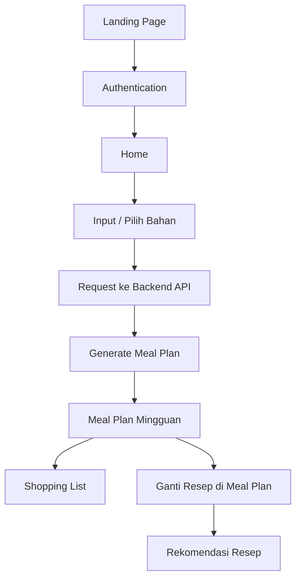

<h1 align="center" >Smart Grocery Planner</h1>

---
Aplikasi rekomendasi resep dan meal plan berbasis bahan makanan yang dimiliki pengguna. Project ini menyediakan antarmuka pengguna untuk autentikasi, pengecekan bahan, rekomendasi resep, pembuatan meal plan, daftar belanja, dan profil pengguna.

Website: [Smart Grocery Planner](https://grocery-planner-dt.netlify.app/)

## Daftar Isi

---
- [1. Deskripsi Singkat Proyek](#1-deskripsi-singkat-proyek)
- [2. Arsitektur Frontend](#2-arsitektur-frontend)
- [3. Fitur Utama](#3-fitur-utama)
- [4. Setup Environment](#4-setup-environment)
- [5. Cara Menjalankan Aplikasi](#5-cara-menjalankan-aplikasi)
- [6. Environment Variables](#6-environment-variables)
- [7. Struktur Proyek](#7-struktur-proyek)
- [8. Build dan Preview](#8-build-dan-preview)
- [9. Teknologi yang Digunakan](#9-teknologi-yang-digunakan)

## 1. Deskripsi Singkat Proyek

---
Project ini merupakan aplikasi frontend yang dibangun menggunakan React dan Vite. Aplikasi ini berfungsi sebagai antarmuka pengguna untuk sistem rekomendasi resep dan penyusunan meal plan.

Melalui aplikasi ini, pengguna dapat melakukan autentikasi, mengelola bahan makanan, melihat rekomendasi resep, membuat rencana makan mingguan, melihat detail resep, serta membuat daftar belanja berdasarkan kebutuhan meal plan.

Fokus utama frontend adalah memberikan pengalaman pengguna yang sederhana, responsif, dan mudah digunakan dalam proses perencanaan makanan sehari-hari.

## 2. Arsitektur Frontend

---
Alur kerja umum aplikasi:

1. Pengguna membuka aplikasi melalui halaman landing.
2. Pengguna melakukan sign in atau sign up.
3. Setelah berhasil login, pengguna diarahkan ke halaman utama.
4. Pengguna dapat memasukkan atau memilih bahan makanan yang tersedia.
5. Frontend mengirim request ke backend API untuk mendapatkan rekomendasi resep atau meal plan.
6. Data hasil rekomendasi ditampilkan dalam bentuk kartu resep, detail resep, meal plan, dan shopping list.


## 3. Fitur Utama

---
Fitur utama aplikasi frontend:

- Meal plan mingguan.
- Rekomendasi resep berdasarkan bahan makanan yang dimiliki.
- Daftar belanja berdasarkan kebutuhan meal plan.



## 4. Setup Environment

---
Pastikan Node.js dan npm sudah terpasang pada perangkat.

### Clone repository
```bash
git clone <URL_REPOSITORY> 
cd <NAMA_FOLDER_PROJECT>
```

### Instalasi dependencies
```bash
npm install
```


## 5. Cara Menjalankan Aplikasi

---
Jalankan aplikasi pada mode development menggunakan perintah berikut:
```bash
npm run dev
```

Setelah server berjalan, buka URL yang muncul di terminal, contohnya:
```bash
http://localhost:3000/
```


## 6. Environment Variables

---
Project ini menggunakan environment variables untuk konfigurasi URL autentikasi dan backend API.

Buat file `.env` di root project, lalu isi konfigurasi berikut:

```env
VITE_NEON_AUTH_URL=https://ep-xxx.neonauth.us-east-2.aws.neon.build/neondb/auth
VITE_BACKEND_URL=<URL_BACKEND_API>
```

Keterangan:

- `VITE_NEON_AUTH_URL`: URL autentikasi Neon yang digunakan untuk proses login, register, dan token session.
- `VITE_BACKEND_URL`: URL backend API yang digunakan frontend untuk mengambil data rekomendasi, meal plan, recipe detail, dan data lainnya.

Contoh file environment tersedia pada:

```text
.env.example
```

## 7. Struktur Proyek

---
```text
public/ # file statis frontend,
src/ 
    assets/ # aset gambar dan file statis frontend 
    components/ # komponen reusable seperti card, modal, form, dan navigasi 
    constants/ # data konstan untuk kebutuhan tampilan 
    context/ # React context untuk autentikasi dan state global 
    hooks/ # custom hooks untuk local storage, meal plan, dan data harian 
    pages/ # halaman utama aplikasi 
    utils/ # helper dan utility, termasuk API fetch dan date helper 
```

## 8. Build dan Preview

---
Untuk membuat production build:
```bash
npm run build
```

Hasil build akan dibuat pada folder:
```text
dist/
```

Untuk menjalankan preview hasil build:
```bash
npm run preview
```

## 9. Teknologi yang Digunakan

---
- React
- Vite
- React Router
- React Icons
- Tailwind CSS
- Neon Auth
- JavaScript